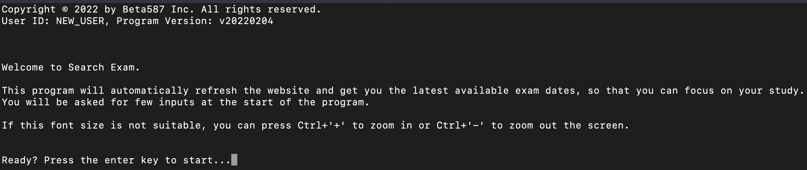
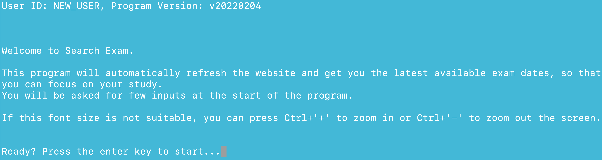
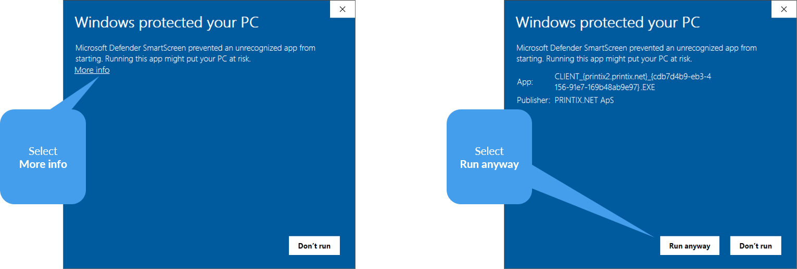
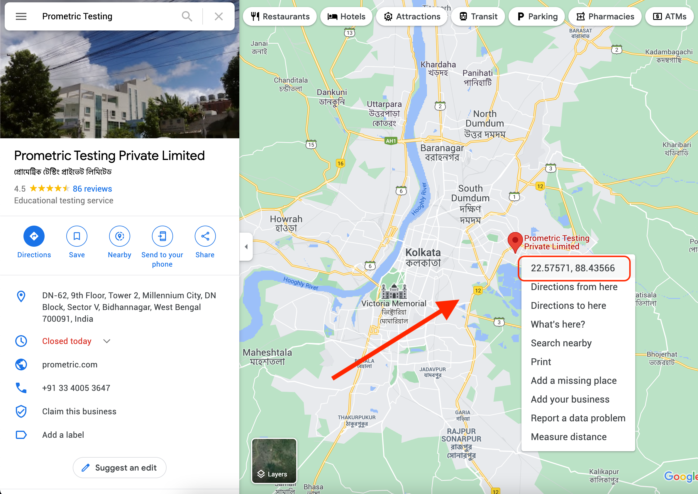
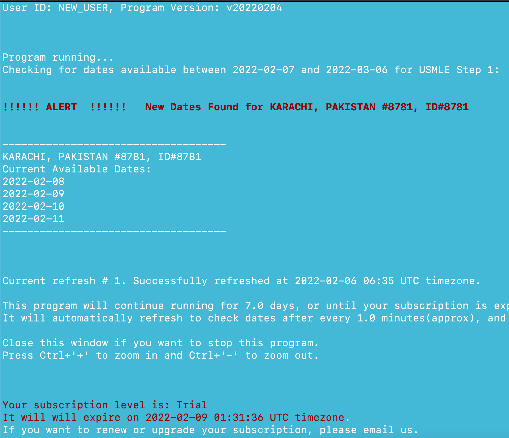
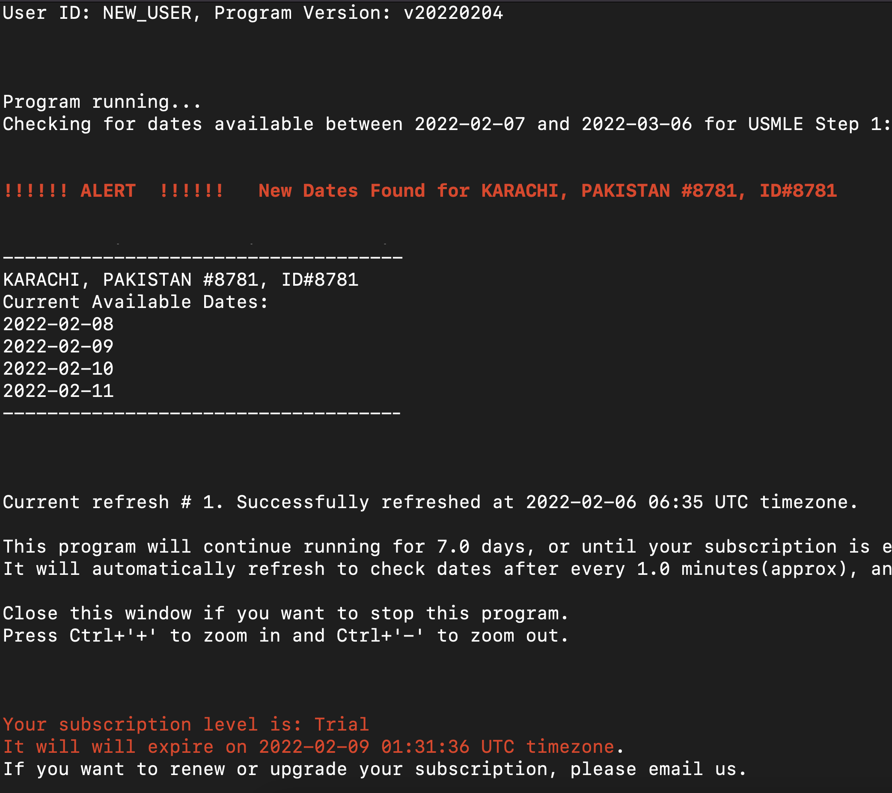

- [How to use Search Exam software](#how-to-use-search-exam-software)
    - [Windows protected screen](#windows-protected-screen)
  - [Input questions](#input-questions)
    - [Taking care of format](#taking-care-of-format)
    - [Taking are of limitations](#taking-are-of-limitations)
    - [Entering GPS Coordinates for location of exam center](#entering-gps-coordinates-for-location-of-exam-center)
  - [Finally - The dates screen](#finally---the-dates-screen)

# How to use Search Exam software

Please download and open the software as explained in the [download](../download) section.

Once you open the software, it takes a few minutes to load initially. It is actually working in the background even if it may appear stuck. Please be patient till you see the welcome screen like this.
(If you can't read the image, right click on it and open it in new tab).

### Windows protected screen
When you open the program for the very first time, you may see this blue screen “Windows protected your PC” which means that Windows didn’t recognize this software. **If** you see this screen, click on More Info  and then click on Run Anyway.

## Input questions

Software will ask you to input some parameters like start date, end date, location of exam center etc. This is similar to how you select the start date, end date and location on the website.

However, you use the mouse on the website, but here you have to write the inputs with keyboard and press the enter key.

### Taking care of format
While entering inputs, please take special care of the format . For example, **dates** should be entered in YYYY-MM-DD format like 2022-12-31. For some questions like **Refresh Interval**, you only have to write digits, no alphabets. (Refresh Interval means how regularly should the software refresh the website and check for new dates).

### Taking are of limitations
While entering inputs, please take care of the limitations. For example, there is a question about how long this program should run continuously. It's maximum limit is 30 for standard subscription plan (which means you have to start the software again after a month - During those 30 days it will regularly check the dates for you without your interference).

### Entering GPS Coordinates for location of exam center

To select the location of exam center, you can **not** simply write the city name. 

You would need to input the GPS coordinates of the exam center for which you want to find the available dates.

For example, if you want to see the dates for exam center in  Gurugram, India, you should input 28.421080, 77.043670

It is fairly easy to find GPS coordinates of any location using [Google maps](https://www.google.com/maps). 

- Search your desired exam center on google maps.
- Right click on the location and you will see the coordinates for that location.
- Click on the coordinates and it will be copied.
- Then paste it into Search Exam software when it asks to input GPS coordinates. 
- For example, for Prometric center near Kolkata, India, you should enter  22.575710, 88.435663

## Finally - The dates screen

After entering all the inputs correctly, you will see the available dates like this:

