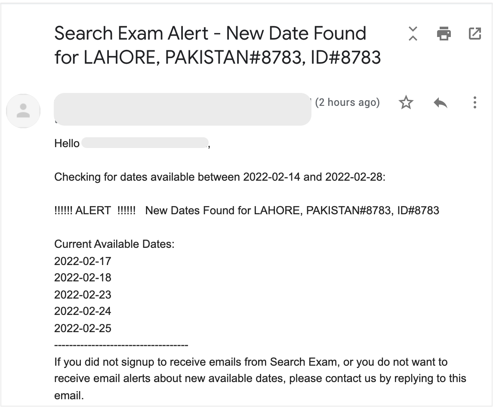

<!-- this is the homepage -->

# Welcome to Search Exam

Are you also having difficulty to find suitable exam dates on the website? When a date becomes available, it is quickly taken by someone else before you get to know about it.

Instead of checking the website again and again yourself, you can use 'Search Exam' to do this.

### What is Search Exam?
Search Exam is a software that automatically checks the website after set intervals. It plays an alarm and sends you an email whenever a new exam date is found.

### Why use Search Exam?
- Save your time - let the software check the website regularly, instead of you.
- Reduce stress of not finding a date
- Never miss a date again - get alert as soon as new date becomes available
- Save your money - no need to purchase extension just because you couldn't find a date
  

### Sounds cool?
If you are interested in trying out, please visit the [**download**](/download/) page.

### Sample Email Screenshot:
<!--  -->

