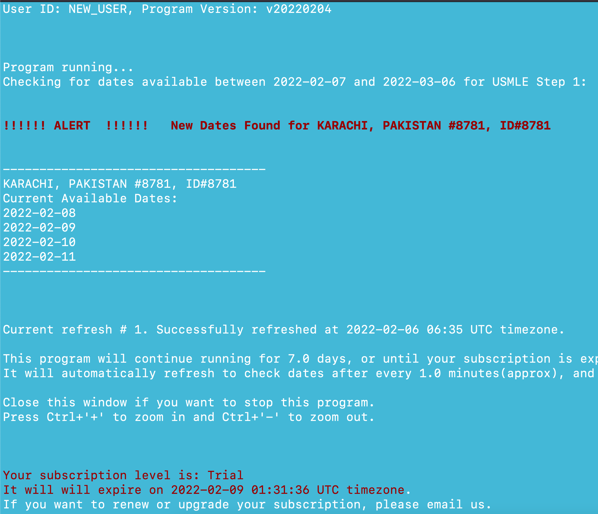

<!-- this is the homepage -->

# Welcome to Search Exam

Are you also having difficulty to find suitable exam dates on the website? People usually postpone their exam and their date becomes available, but it is very quickly taken away by someone else.

Instead of checking the website again and again yourself, why not use 'Search Exam' to do this part, so that you can focus on your study.

### What is Search Exam?
Search Exam is a software that automatically checks the website after set intervals. It plays an alarm and sends you an email whenever a new exam date is found.

### Sounds cool?
If you are interested in trying out, please visit the [download](/download/) page.

### Sample Screenshot
<!--  -->

